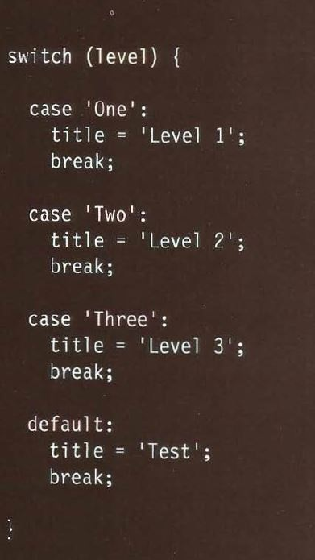

# HTML Lists, Control Flow with JS, and the CSS Box Model
## HTML lists  
there are 3 types of lists in html:  
- Ordered
- Unordered 
- Definition
   
Ordered lists list items start with numbers.  
Unordered lists list items start witb bullets.  
Definition list is used to define some terms.  

## CSS box model  
css treats each html element as its own box, css allowes to control many properties of these boxes.  
such as height, width, visiblity and boreder colors, shape and width. there is also shading and many other properties.  

## Control flow with js
conditional statements control weather a block of code is excuted based on weather if the condition is true or false there are 4 types which are the if statement, while statement, do while statement and switch statement.  
switch statement is uses when you want to compaire a certain value with multiple possible others.  
its syntax is fairly simple and is as the following image:  
 .