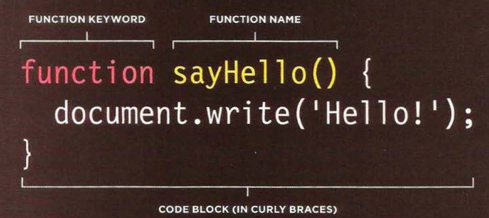

# HTML Links, CSS Layout, JS Functions
## HTML Links  
links are how we go from page to page in the same website or from website to another website.
links in html are created useing the `<a href="URL">link name</a>` tags href is the attribute that its value is the address of the page we like to move to.  
the address of an external website should be absoulte which means the full URL.  
as for the address of a page in the same website should be the realtve path to the root directory.  
## CSS Layout  
css controls the layout of the page by manipulating its content. it can manipulate the contents using the float and position attributes. float has some problems though and thus the atrribute clear was made. it decides weather some other box or container should touch the edges of the cleared container or box. there are CSS framworks that makes the process of layouting the page easier.  
## JS Functions  
functions are a block of code that we can do whenever we need to without the need of copying or pasting.  
the syntax of a simple function is:  
the word function followed by the function name (which should somehow relate to what the funcion does) followed by parentheses and curly braces which contain the code.  
 